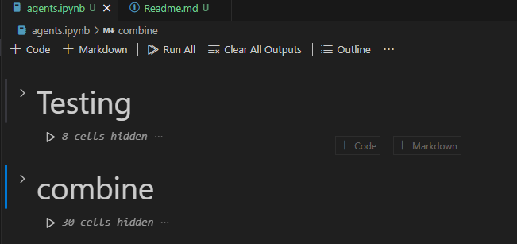
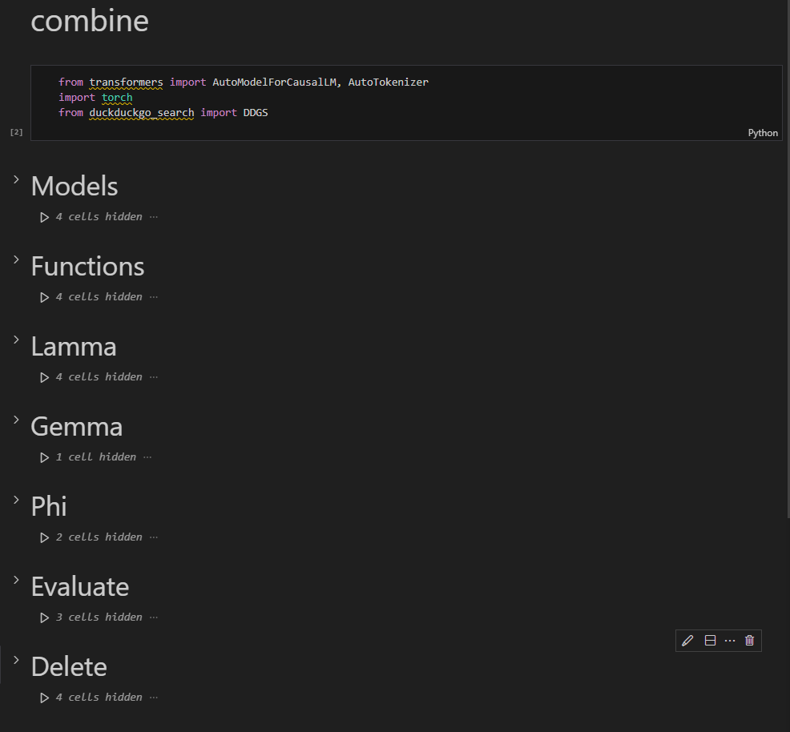

# CS 793 LLM Agents With Web Search

Yunrui Huang

11/15/2024

-----

## Dependency

### Model

Note: All the models need to be `modelname-instruct `, which include a chat_template

* Llama 3.2 1B
  * https://huggingface.co/meta-llama/Llama-3.2-1B-Instruct
* Llama 3.2 3B
  * https://huggingface.co/meta-llama/Llama-3.2-3B-Instruct
* Phi 3.5 mini
  * https://huggingface.co/microsoft/Phi-3.5-mini-instruct
* Gemma 2 2B
  * https://huggingface.co/google/gemma-2-2b-it

### lib

` torch`

`transformers`

`accelerate`

`duckduckgo_search`

**Tutor**

https://huggingface.co/docs/transformers/quicktour

https://pypi.org/project/duckduckgo-search/

## Code

The cord code show on my PPT is save in the [agents](agents.ipynb) file, under the combine 

Models use for load the model in

Functions contain all the Function and prompts we need

Evaluate contain the testing input, function call and evaluate

Delete help to un-load the model from the GPU for save the memory space

